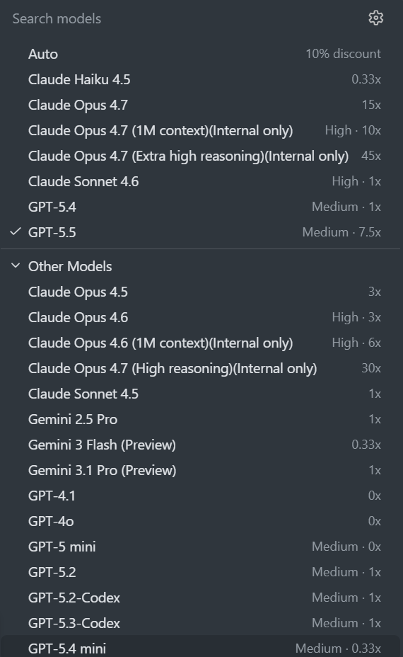
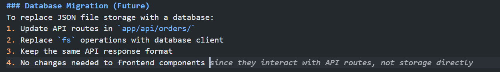

# How-To: Choose the Right Model

Under usage-based billing (UBB), each Copilot model has its own **per-token price** for input, output, and cached tokens — and prices span roughly 25× across the lineup. Picking the right model is one of the biggest cost levers you have.

> **Goal:** use the cheapest model whose per-token pricing matches the value of the answer you need.

---

## 1. Switch the model in VS Code Chat

**VS Code:**

- At the bottom of the Chat input, click the **model picker** (shows current model name).
- Pick a lightweight model for routine work, a powerful one for hard problems.
- For mixed-complexity sessions, choose **`Auto`** — [Copilot auto model selection](https://docs.github.com/en/copilot/concepts/auto-model-selection) picks based on real-time system health. On paid plans still on request-based billing, Auto also gets a 10% multiplier discount.

> 💡 Under UBB, the model you pick directly controls the per-token rate of every interaction — see [Understand AI Credits & Per-Token Pricing](ai-credits.md) for the full pricing table.

---

## 2. Quick model-selection guide

| Task | Suggested tier | Example models |
| --- | --- | --- |
| Renames, syntax help, doc lookups, simple Q&A | **Lightweight** | GPT-5 mini, Gemini 3 Flash, Grok Code Fast 1, Claude Haiku |
| Single-file edits, small refactors, test scaffolding | **Versatile** | GPT-4.1, GPT-5.4 mini, Claude Sonnet |
| Multi-file refactors, architectural design, deep debugging | **Powerful** | GPT-5.4 / 5.5, Claude Opus, Gemini Pro |
| Repetitive code completions while typing | **Inline suggestions / next edit suggestions** | (Not billed in AI Credits on paid plans) |

> Names change over time — apply the *tier* rule, not specific model names. See [Models and pricing](https://docs.github.com/en/copilot/reference/copilot-billing/models-and-pricing) for current per-token rates.

---

## 3. Try the cheap model first

Workflow:

1. Ask your question with a **lightweight** model.
2. If the answer is wrong or shallow, escalate to a **versatile** or **powerful** model in the same chat (the model picker switches mid-conversation).
3. Note the pattern — next time, start at the right tier.

---

## 4. Use inline suggestions for everyday code

Inline ghost-text completions (the gray suggestions while you type) are a **separate surface** from Chat — and they are **not billed in AI Credits** on paid plans ([source](https://docs.github.com/en/copilot/reference/copilot-billing/models-and-pricing#code-completions)).

- Copilot Free includes up to **2,000** real-time code suggestions per month.
- Paid Copilot plans include unlimited real-time code suggestions and next edit suggestions with included models.

For routine code, accept inline suggestions instead of opening Chat — it doesn't draw any AI Credits.

> 📸 **Screenshot needed:** `docs/images/inline-completion.png` — editor showing gray ghost-text suggestion mid-line.

---

## 5. Set a default model per workspace (optional)

VS Code remembers the last-used model per chat. If your workspace is mostly routine, leaving the default on a lightweight model (or `Auto`) nudges you toward cheaper-per-token calls.

[← Back to README](../readme.md)
