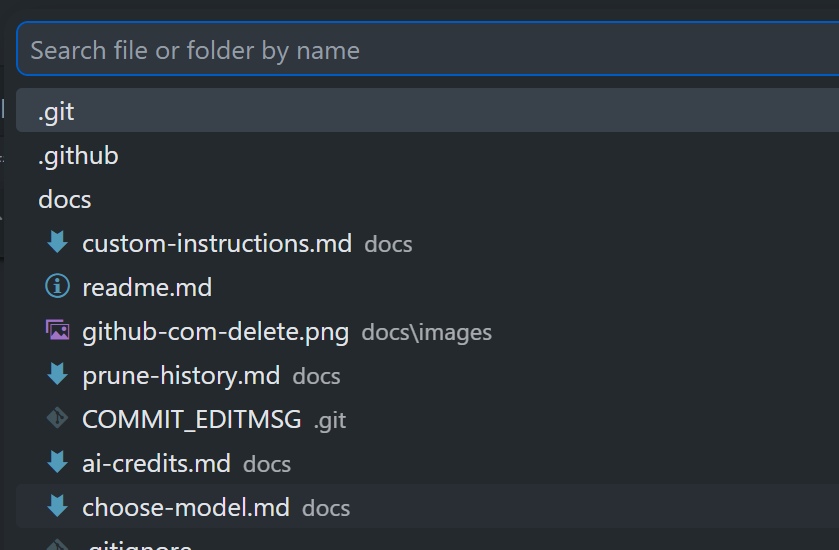
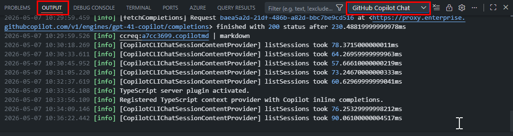

# How-To: Externalize Custom Instructions

Anything in your "always-on" instructions (`copilot-instructions.md` and matching `*.instructions.md` files) is sent to the model on **every chat turn** as input tokens. Under usage-based billing, every token you keep in always-on instructions is paid for on every reply, forever. Keep persistent instructions tiny; move the rest to on-demand prompt files, scoped instructions, or skills.

> **Goal:** stop paying input tokens for boilerplate you don't need on every call.

---

## 1. Audit your current custom instructions

**VS Code:** open `.github/copilot-instructions.md` (or your `*.instructions.md` files) and ask:

- Does **every** chat turn need this? If no → move it out.
- Is it a **role description** ("You are a senior engineer who…")? Usually trim-able.
- Is it a **style rule** that only applies to one language/folder? Move to a scoped instructions file.
- Does it record an exact build, test, or lint command the agent needs to run?
- Does it prevent a mistake you have observed repeatedly, rather than a hypothetical one?

### Give Copilot a concise project map

A short navigation map can save repeated repository exploration. Include only stable, high-value orientation such as important directories, entry points, test locations, and non-obvious boundaries. Link to detailed architecture documentation rather than embedding it in always-on instructions.

For example:

```markdown
- API entry point: `src/api/server.ts`
- Database migrations: `db/migrations/`
- Run focused tests with `npm test -- <path>`.
- Do not edit generated clients under `src/generated/`.
```

This is different from including a full architecture overview. The map helps the agent find the source of truth; it should not duplicate that source ([source](https://docs.github.com/en/copilot/tutorials/optimize-ai-usage#give-copilot-a-map-of-your-project)).

---

## 2. Use scoped `.instructions.md` files with `applyTo`

Instead of one global instructions file, use multiple scoped ones. Each only loads when relevant files are in context.

Example: `.github/instructions/typescript.instructions.md`

```markdown
---
applyTo: "**/*.ts,**/*.tsx"
---

- Use `unknown` over `any`.
- Prefer named exports.
- No default exports for components.
```

This rule only loads when a `.ts`/`.tsx` file is part of the conversation.

---

## 3. Move "how to do X" knowledge into prompt files

For workflows you only run sometimes (e.g. *"write a release note"*, *"generate a PR description"*), use a `.prompt.md` file instead of stuffing the steps into global instructions.

Example: `.github/prompts/release-notes.prompt.md`

```markdown
---
agent: ask
---

You are generating release notes. Group changes under
**Features**, **Fixes**, **Chores**. Use the diff in context.
```

Invoke it on demand from the chat input — its tokens only count on the turns you actually run it.




---

## 4. Move domain knowledge into skills (`SKILL.md`)

For larger bodies of knowledge ("how our deployment works", "our coding conventions deep-dive"), use a **skill**. Skills are loaded into context **only** when their description matches the user's request.

Rough sizing guide:

| Content                             | Where it should live                      |
| ----------------------------------- | ----------------------------------------- |
| 1–2 lines, applies to all chats     | Global `copilot-instructions.md`          |
| Language- or folder-specific rules  | Scoped `*.instructions.md` with `applyTo` |
| Multi-step workflow run on demand   | `*.prompt.md`                             |
| Larger domain knowledge / playbooks | Skill (`SKILL.md`)                        |

---

## 5. Quick wins to remove from global instructions

These are common bloat sources — almost always cheaper somewhere else:

- ❌ "You are an expert in X, Y, Z, A, B, C…"
- ❌ Long lists of *every* coding convention.
- ❌ Full architecture overviews.
- ❌ Sample code blocks "for reference".
- ❌ Politeness preambles ("Always be polite and thorough…").

---

## 6. Verify what's actually being sent

In VS Code, you can inspect the resolved context for a turn:

- Use the chat customization diagnostics view (Right-click Chat view → Diagnostics) and the Chat Debug view to see which instructions were applied.
- Look for instruction blocks; trim anything that doesn't earn its place.



---

## 7. Turn recurring Chronicle findings into instructions

Use Copilot CLI's `/chronicle tips` and `/chronicle cost-tips` to identify patterns in your recent sessions, then convert only recurring, verified findings into repository guidance:

1. Run `/chronicle tips` or `/chronicle cost-tips`.
2. Confirm that the issue recurs across multiple sessions.
3. Add the smallest instruction that prevents it.
4. Review later sessions and revise or remove the instruction when it stops helping.

Examples of grounded instructions:

- `Run npm test -- --runInBand after changing authentication code.`
- `Search src/api before adding another HTTP client.`
- `Do not modify generated files under dist/.`

Treat Chronicle output as evidence to review, not text to paste wholesale. Persistent instructions should remain short, specific, and grounded in observed behavior ([source](https://docs.github.com/en/copilot/tutorials/optimize-ai-usage#feed-insights-into-a-copilot-instructionsmd-file)).

---

[← Back to README](../readme.md)
