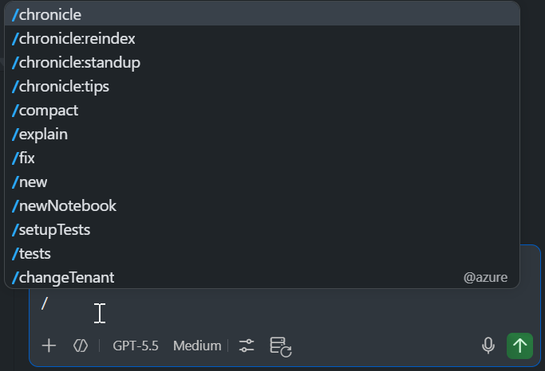

# How-To: Ask Focused Questions

Broad prompts produce essays. Focused prompts produce answers. Under usage-based billing (UBB), **output tokens are the priciest bucket** — typically ~4–8× the input rate — so constraining what comes back is one of the highest-leverage levers you have.

> **Goal:** small, precise input → small, precise output → fewer AI Credits per answer.

---

## 1. Replace "tell me about X" with "show me Y"

| ❌ Broad | ✅ Focused |
| --- | --- |
| "Tell me everything about our batch jobs" | "List the failed batch jobs in the last hour and the top error message for each" |
| "Explain authentication" | "Where is the JWT validated in this file?" |
| "Improve this code" | "Reduce the time complexity of `processItems` from O(n²) to O(n)" |
| "Write tests" | "Write 3 unit tests for `parseInput`: valid input, empty string, malformed JSON" |

The right column typically returns much shorter answers for the same useful outcome.

---

## 2. Constrain the output format

Cap response length explicitly:

- "Summarize in **5 bullet points**."
- "**Just the function signature**, no explanation."
- "Return **only the changed lines** as a diff."
- "**Code only**, no commentary."
- "**Yes/no plus one sentence** of reasoning."

---

## 3. Break "kitchen-sink" prompts into steps

Don't bundle five unrelated tasks into one message. You'll get a long answer that mixes them awkwardly — and pay for every token of that long answer.

❌ One mega-prompt:

```text
Refactor this module, write tests, update the docs, fix the type errors,
and explain the design.
```

✅ Sequence of focused prompts in the same chat:

```text
1. Fix the type errors in this file.
2. Refactor `handleEvent` to use early returns.
3. Write tests for the refactored function.
```

You only pay for what you actually need at each step, and each step's output is shorter.

---

## 4. Ask for the smallest unit that solves your problem

| You want | Ask for |
| --- | --- |
| To know if a fix is possible | "Yes/no: can this be done with a single regex?" |
| The shape of a solution | "Sketch the function signature only" |
| To start coding | "One example call site" |
| The full implementation | (only when ready) "Implement the function" |

Climb the ladder only as far as you need.

---

## 5. Use scoped slash commands when available

Many slash commands implicitly focus the model:

- `/explain` — focused on the selected code only
- `/fix` — focused on the diagnostic / selection
- `/tests` — focused on generating tests for the selection

These are cheaper than free-form prompts because they bound both the input and the expected output — directly limiting tokens on both sides.


> 📸 **Screenshot needed:** `docs/images/slash-commands.png` — chat input showing the `/` suggestion popup.

---

[← Back to README](../readme.md)
