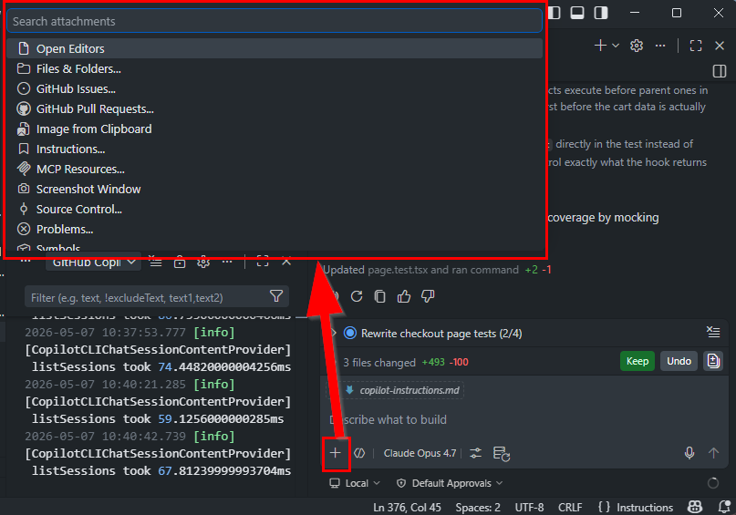
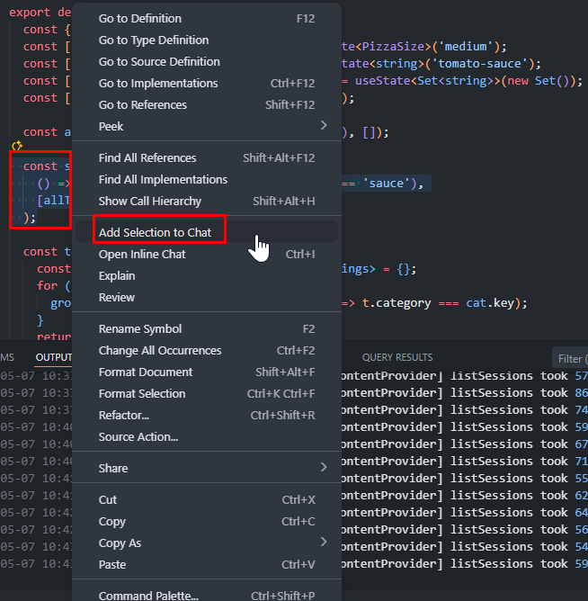
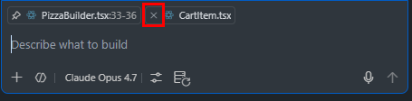

# How-To: Manage Context Attachments

Every file, selection, or terminal output you attach is sent on **every turn** until you remove it. Lean attachments = lean bills.

> **Goal:** attach only what's needed, and remove it when done.

---

## 1. Attach a specific file (not the whole workspace)

**VS Code:**

- In the Chat input, click the **paperclip / + Add Context** button.
- Choose **Files & Folders** → pick the single file you need.

---

## 2. Attach only a selection

Better than attaching the whole file when you have one function in mind.

- Highlight the relevant code in the editor.
- Right-click → **Copilot → Add Selection to Chat**, or drag the selection into the Chat panel.

---

## 3. Remove attachments you no longer need

The attachment chips above the chat input persist across turns.

- Click the **×** on any chip to drop it.

---

## 4. Avoid `#codebase` for narrow questions

`#codebase` (workspace-wide context) pulls in many files. Use it for genuinely cross-cutting questions; for anything narrower, attach the specific file(s).

| Question | Use |
| --- | --- |
| "Where is the auth flow defined?" | `#codebase` |
| "Why does this function return null?" | Selection or single file |
| "Refactor this class" | Single file |

---

## 5. Reference, don't repaste

If you've already shared context earlier in the same chat, refer back to it:

- ❌ Re-paste the schema each turn.
- ✅ "Using the schema from earlier, write a query that…"

---

## 6. Use the right tool over the right context

Sometimes the cheapest "context" is no context — let a tool fetch what it needs:

- A search/grep tool can find a symbol faster (and cheaper) than attaching ten files.
- A terminal command's output is one line in chat instead of a 200-line attachment.

---

[← Back to README](../readme.md)
