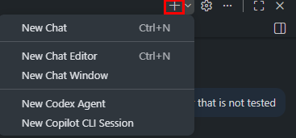
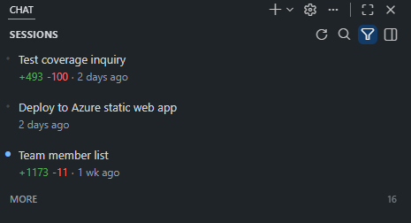
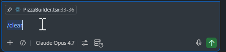
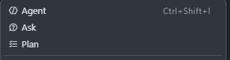
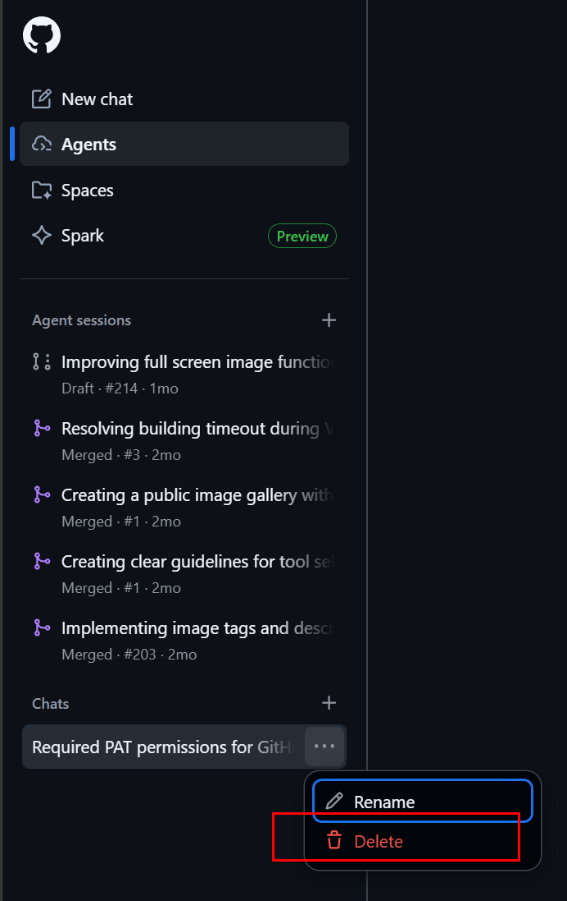

# How-To: Prune Chat History

Long Copilot Chat sessions silently inflate token cost because every turn replays prior context. Use these techniques to keep the context window small.

> **Goal:** end conversations cleanly, drop stale context, and start fresh when you switch tasks.

---

## 1. Start a new chat (most common)

The fastest reset. Use it any time you switch tasks or files.

**VS Code:**

- Click the **+ New Chat** icon in the Chat view title bar, **or**
- Press `Ctrl+L` (Windows / Linux) or `Cmd+L` (macOS) while the Chat view is focused.




---

## 2. Browse and switch chat history

Instead of continuing a bloated thread, jump to (or start from) a cleaner one.

**VS Code:**

- Click the **clock / history icon** in the Chat view title bar.
- Pick an older session, or click **New Chat** at the top.


> 📸 **Screenshot needed:** `docs/images/chat-history.png` — Chat history flyout showing past sessions.

---

## 3. Use the `/clear` slash command

Wipe the active conversation's context without leaving the panel.

In the chat input, type:

```text
/clear
```

Press **Enter**. The conversation is reset; the panel stays open.




---

## 4. Remove attached context (files, selections, problems)

Files and selections you've attached are sent on **every turn** until you remove them.

**VS Code:**

- Above the chat input, find the chips for attached files / selections / terminal output.
- Click the **×** on any chip you no longer need.


---

## 5. Switch chat modes to start fresh

Each mode (**Ask**, **Edit**, **Agent**) keeps its own context. Switching modes for a new task gives you a clean slate without losing the option to come back.




---

## 6. Summarize-and-restart (Agent mode)

When you've made progress in a long agent session but the context is getting heavy:

1. Ask the agent:

   ```text
   Summarize what we've decided and the current state in 5 bullet points.
   ```

2. Copy the summary.
3. Start a **New Chat** (`Ctrl+L`).
4. Paste the summary as your first message.

You keep the *decisions* without paying for the full prior transcript.

---

## 7. Delete sessions on github.com

For Copilot Chat in the browser:

- Open the **conversation list** in the left sidebar.
- Hover a thread → click the **⋯ menu** → **Delete**.
- Or click **New chat** at the top.




---

## Rule of thumb

Start a new chat whenever:

- ✅ You switch tasks or files
- ✅ The conversation passes ~20 turns
- ✅ Answers start referencing irrelevant earlier context
- ✅ You're done with the immediate goal

This single habit is the highest-leverage pruning you can do.

---

[← Back to README](../readme.md)
