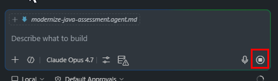
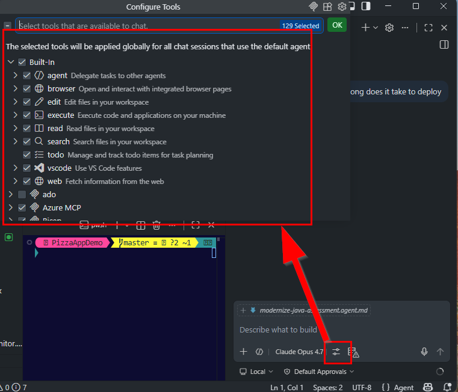

# How-To: Use Tools & Agents Efficiently

Agents shine when they call **tools** to do real work. They burn tokens when they "think aloud" through what a tool already does.

> **Goal:** prefer tool calls over LLM reasoning, and keep agent chains short.

---

## 1. Prefer a real tool over LLM reasoning

If a tool, command, or API exists for the task, ask the agent to use it directly instead of inventing the answer.

| ❌ Token-heavy ask | ✅ Tool-first ask |
| --- | --- |
| "Figure out which tests fail" | "Run the test task and report failures" |
| "Walk me through what files changed" | "Run `git diff --stat` and summarize" |
| "Reason about which functions call `foo`" | "Find usages of `foo` and list them" |
| "Write and explain a KQL query for X" | "Use the App Insights tool to fetch X" |

The LLM stops narrating; it just orchestrates.

---

## 2. Keep agent chains short

Each planning / reflection step is another model call. Watch for runaway chains:

- 🚩 The agent restates the plan every turn.
- 🚩 The agent re-reads the same file repeatedly.
- 🚩 The agent runs the same test multiple times without changing code.

When you see this, **stop the agent**, summarize where you are, and start a focused new prompt.

---

## 3. Give the agent a small, well-scoped goal

Agent prompts that begin with **"do everything for…"** explode into many tool calls.

❌ "Set up the whole project."

✅ "Create a `src/utils/date.ts` file exporting `formatIso(date: Date): string`. Add a unit test."

The smaller the scope, the fewer tools fire, the fewer tokens you spend.

---

## 4. Disable tools you don't need

Most chat surfaces let you turn individual tools on/off for a session. Disabling unused tools:

- Removes their definitions from the prompt (saves input tokens).
- Prevents the agent from calling them speculatively.

---

## 5. Use specialized agents/skills for specialized work

A single mega-agent loaded with every domain rule pays for that whole prompt **on every call**. Specialized sub-agents or skills only pull weight when invoked.

| Pattern | Cost shape |
| --- | --- |
| One monolith agent (auth + billing + ops + docs) | Fat prompt every call |
| Specialized skills (`/auth`, `/billing`, …) invoked on demand | Thin prompt by default |

---

## 6. Offload deterministic work to plain code

Anything that doesn't need an LLM, shouldn't use one:

- Date math → use `date-fns`, not the model.
- JSON shape changes → use a script, not a prompt.
- Lookups → use a database query, not "what is X in the docs?".

Save the LLM for genuine reasoning.

---

[← Back to README](../readme.md)
